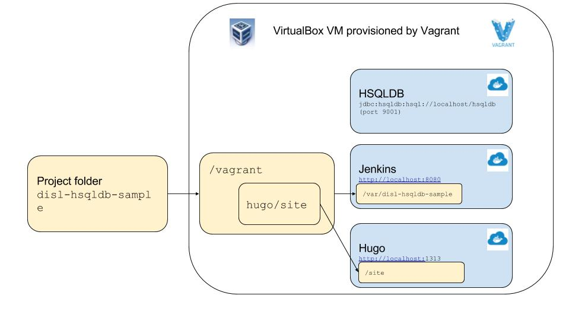

# disl-hsqldb-sample
Sample project demonstrating basic features of DISL.

## Quick start

1. Install [Virtual Box](https://www.virtualbox.org/).
2. Install [Vagrant](https://www.vagrantup.com/downloads.html).
3. Clone or download disl-hsqldb-sample project from Github.
```
git clone https://github.com/kaja78/disl-hsqldb-sample.git
cd disl-hsqldb-sample
```
4. Build documentation site `gradlew buildDislDoc`
5. Start development environment. `vagrant up`
6. Run jobs from [Jenkins](http://localhost:8080).
7. Run queries in development database. `gradlew startDbClient`
8. Modify project and rerun jobs from [Jenkins](http://localhost:8080).
9. Browse project [documentation site](http://localhost:1313). 
    
    

### Vagrant commands

* vagrant up - Start vagrant virtual machine.
* vagrant halt - Shut down vagrant virtual machine.
* vagrant ssh-config - Display vagrant machine connect information. 
